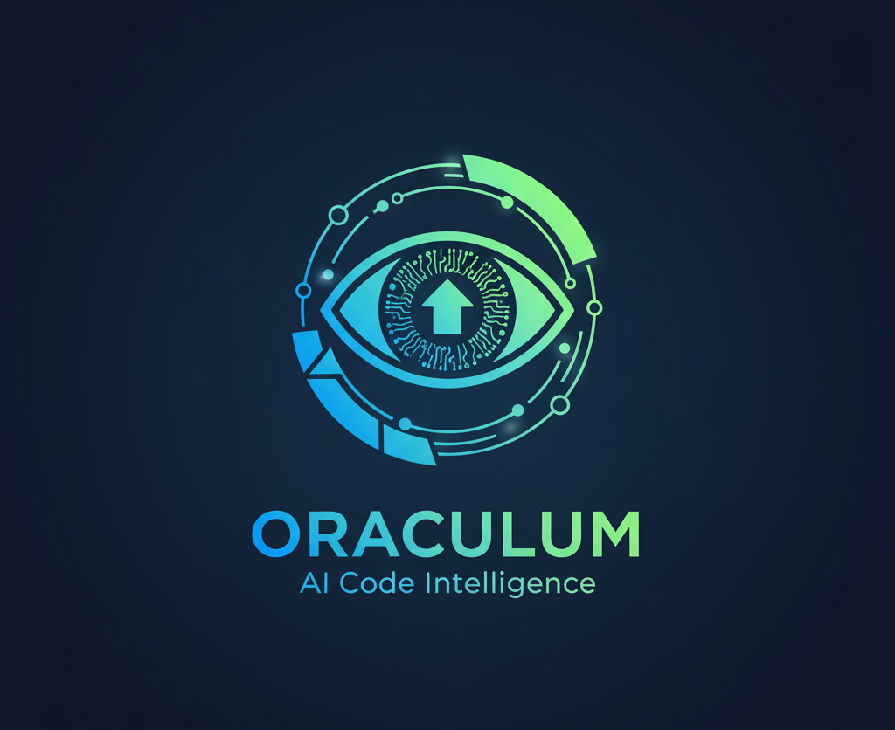

# Oraculum IA




> **Oraculum IA** é um analisador de código que usa **Modelos de Grande Linguagem (LLMs)** para avaliar qualidade, apontar problemas e sugerir melhorias práticas. Funciona com **Claude (API da Anthropic)** ou **Ollama** local – ideal para quem quer rodar offline.

## ✨ Funcionalidades

- 📤 **Upload de arquivos** e **pré-visualização** das primeiras 10 linhas
- 🤖 **Escolha do provedor de IA**: *Claude (API)* ou *Ollama (local)*
- 🧠 **Análise guiada** por critérios objetivos (nomes, tamanho de função, erros, aninhamento, efeitos colaterais, números mágicos)
- 🧾 **Retorno estruturado em JSON** (pontuação 0–100, resumo e lista de melhorias)
- 🚦 **Severidade por item** (*low/medium/high*) com ícones e cores
- ⚙️ **Painel de Configuração** (endpoint e modelo do Ollama; seleção de provedor)
- 🛡️ **Mensagens de erro amigáveis** e tratamento de respostas inesperadas
- 🌐 **Suporte multilíngue** do app (pt-BR no momento)
- 🧩 **Detecção básica de linguagem** pelo sufixo do arquivo (py, tsx, java, go, etc.)

## 🧱 Stack e Arquitetura

- **Frontend:** React + Vite + TailwindCSS
- **UI/Ícones:** lucide-react
- **Provedores de IA:** Claude (HTTP API) • Ollama (localhost)
- **Renderização do resultado:** cartões com *score*, *summary* e lista de *improvements*

## 🔧 Pré-requisitos

- **Node.js >= 20.19.0** (ou >= 22.12) — exigência do Vite
- **npm** ou **pnpm** ou **yarn**
- **(Opcional) Ollama** instalado e rodando em `http://localhost:11434`
  - Ex.: `ollama run gpt-oss:20b`, `deepseek-coder`, `codellama`, etc.
- **(Opcional) Claude API** (requer chave e cabeçalhos oficiais)

> ⚠️ Se você usar Node 18, o Vite falha com erros como `crypto.hash is not a function`. Atualize o Node.

## 🚀 Instalação

```bash
git clone https://github.com/IMNascimento/Oraculum.git
cd Oraculum
npm install
```

### Tailwind já incluso
O projeto usa Tailwind; certifique-se que estes pontos existem:
- `index.css` com as diretivas `@tailwind base; @tailwind components; @tailwind utilities;`
- `tailwind.config.js` com `content` apontando para `src/**/*.{ts,tsx,js,jsx,html}`
- O Vite está importando o `index.css` em `main.tsx`

## ▶️ Uso (Dev)

```bash
npm run dev
```
Acesse **http://localhost:5173** (padrão do Vite).

No topo da UI, clique em **Configuração** para alternar entre **Claude** e **Ollama**:

- **Ollama (recomendado para começar):**
  - Deixe `Endpoint` como `http://localhost:11434`
  - Informe um `Modelo` disponível (ex.: `gpt-oss:20b`, `deepseek-coder`, `codellama`)
  - Faça upload de um arquivo de código e clique **Analisar Código**

- **Claude (API da Anthropic):**
  - O código base demonstra a chamada, mas **você deve adicionar os cabeçalhos oficiais**.
  - Veja abaixo como configurar.

## 🔑 Configurando a Claude API (Anthropic)

A função `analyzeWithClaude` **precisa** dos cabeçalhos oficiais. Adapte o *fetch* assim:

```ts
const response = await fetch('https://api.anthropic.com/v1/messages', {
  method: 'POST',
  headers: {
    'Content-Type': 'application/json',
    'x-api-key': import.meta.env.VITE_ANTHROPIC_API_KEY,
    'anthropic-version': '2025-05-14', // Ajuste conforme a versão vigente
  },
  body: JSON.stringify({
    model: 'claude-3-5-sonnet-latest',
    max_tokens: 2000,
    messages: [{ role: 'user', content: prompt }],
  }),
});
```

Crie um arquivo `.env` na raiz com:
```
VITE_ANTHROPIC_API_KEY=coloque_sua_chave_aqui
```

> Dica de segurança: **não exponha sua chave em produção no front**. Para uso real, crie um **proxy/back-end** que injete a chave no servidor e aplique **rate limit** e **auth** (JWT, Keycloak etc.).

## ⚙️ Configuração do Ollama

- Instale o Ollama conforme sua plataforma e garanta que está rodando:  
  `ollama serve` ou simplesmente chame um modelo: `ollama run gpt-oss:20b`
- Endpoints padrão: `http://localhost:11434`
- No app, selecione **Ollama**, configure **Endpoint** e **Modelo** e rode.

## 🧪 Exemplo de Uso

1. Clique em **Enviar Arquivo de Código**
2. Selecione um `.py`, `.ts`, `.tsx`, `.java`, `.go`, etc.
3. Veja a **prévia** das primeiras 10 linhas
4. Clique em **Analisar Código**
5. Confira a **Pontuação Geral** e as **Sugestões de Melhoria** com severidade

### Formato de Saída (JSON)
A aplicação tenta obter **exatamente** este formato do modelo:
```json
{
  "score": 0,
  "summary": "texto",
  "improvements": [
    {
      "category": "nome da categoria",
      "issue": "descrição do problema",
      "suggestion": "como corrigir",
      "severity": "high|medium|low",
      "lineNumber": 0,
      "codeSnippet": "trecho"
    }
  ]
}
```

Se o provider retornar algo diferente, o app exibe o JSON bruto para depuração.

## 🗂️ Suporte de Linguagens (detecção por extensão)

`py, js, jsx, ts, tsx, java, c, cpp, cc, cxx, cs, rb, go, php, swift, kt, rs, r, scala, sh, bash, ps1, lua, dart`

## 🛡️ Segurança e Produção

- **Claude:** use um **servidor** para encapsular a chamada e esconder sua chave
- **Auth:** proteja seu endpoint com JWT, **Keycloak** ou similar
- **CORS/Rate Limit:** configure no servidor proxy
- **Logs:** evite logar código sensível enviado pelos usuários
- **Modelos locais:** avalie políticas de privacidade e *weights licenses*

## 🧭 Roteiro (Roadmap)

- [ ] Suporte a **multi-arquivos** e projetos compactados (.zip)
- [ ] Destacar **linhas** diretamente no *viewer* do código
- [ ] **Exportar** relatório (PDF/Markdown)
- [ ] **Perfis de revisão** por linguagem (Python/TS/Java/etc.)
- [ ] Modo **CLI** para CI/CD
- [ ] Modo **Agente** para correção automática (patches)

## 🤝 Contribuindo

Contribuições são bem-vindas! Abra uma **issue** ou envie um **PR**.  
Siga as diretrizes do `CONTRIBUTING.md` (lint, commit message, escopo por PR, etc.).

## 📄 Licença

Distribuído sob a licença **GPL3**. Consulte `LICENSE` para detalhes.

## 👤 Autores

**Igor Nascimento** — Desenvolvedor Principal — [@IMNascimento](https://github.com/IMNascimento)

## 🙏 Agradecimentos

- Comunidade **Ollama**
- **Anthropic** (Claude)
- **OpenAI** (GPT)
- **SophiaMind** Produção e AI
- **SophiaLabs** Infraestrutura
- **Vite**, **React**, **TailwindCSS**, **lucide-react**
- Todos os contribuidores e testers

---

> **Dica**: Caso o Tailwind não aplique estilos, verifique o caminho do `content` no `tailwind.config.js`, a importação do `index.css`, e rode `npm run dev` com Node atualizado.
